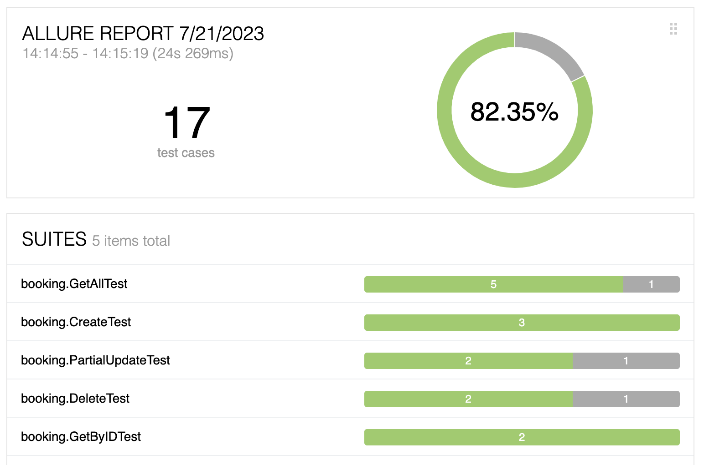

# Payconiq REST-assured Assessment

Java API Testing framework built with JUnit and  and REST-Assured

This project contains automated tests for testing the _booker_ service. The tests are written using Java and executed using Maven with `mvn test`.

## Prerequisites

To run this project, you need the following prerequisites:

- Java Development Kit (JDK) version 17 or later (OpenJDK 17 recommended).
- Apache Maven (version [insert version here]).

## How to Run the Tests

1. Clone the project to your local machine.
2. Navigate to the project directory.
3. Run the tests using Maven. (Or your preferred IDE).

```bash
mvn clean test
```

## Test Report

To enhance the visualization of test results, we can utilize Allure to generate comprehensive test reports:

```bash
mvn clean test -Dallure.results.directory=./target/allure-results
mvn allure:serve 
```



## Continuous Integration

The project is setup to run on every push to main. A disclamer here, is that based on the test architecture that I have defined this tests should be executed on demand
once the _booker_ service starts it's own release pipeline.

## Project Structure

```plain
├── LICENSE
├── README.md
├── pom.xml
└── src
    ├── main
    │   └── java
    │       ├── helpers // this folder contain classes with utilities and other misc functionalities
    │           ├── DataHelper.java
    │       │   └── RequestHelper.java
    │       ├── model // POJO models utilized to encode and decode the Json objects
    │       │   ├── AuthUser.java
    │       │   ├── Booking.java
    │       │   └── PartialBooking.java
    │       └── specifications // provides prebuilt Request specifications that can be reused among tests such as custom headers
    └── test // only test functions will be allocated here
        └── java
            └── booking // tests related to the booking resource
                ├── BaseTest.java // handles the setup and provides functions as test pre-requisites
                ├── Constants.java // constants for this resource
                ├── CreateTest.java
                ├── DeleteTest.java
                ├── GetAllTest.java
                ├── GetByIDTest.java
                └── PartialUpdateTest.java
```

## Notes

- The tests are designed to be clean and independent, minimizing dependencies between them.
- The test scenarios cover basic functionality, but there is potential for improvement by adding more complex data payloads and edge cases.
- Some functions include comments to explain the decision-making process behind the framework used.
- Certain tests were disabled due to issues with the scenarios they test, or they might not fully comply with RESTful API standards. These tests are excluded to maintain the integrity of the test suite.
- Some tests assertions can be improved.
- I also would recommend using json schema validation as a complement to data validation from endpoints.

## Test Strategy

The test strategy document as well as system design and releae process pipeline assets can be found in the `/docs` folder as requested
